这里讲解一下每一份文件的作用以及大致做的内容

## src为主目录文件
训练集形状： (1460, 81)；
测试集形状： (1459, 80)
## 01_check_data.py 
为查看文件，主要作用为查看测试集以及训练集中的样本样式，同时计算出一些基本的统计指标

## 02_target_analysis.py（查看分布）
为对训练集的分析文件，主要查看原房价价格的基础分布，并通过取对数的方法来避免极端房价

得出的两张图片可以在 outputs/figures 下查看

图1：saleprice_distribution
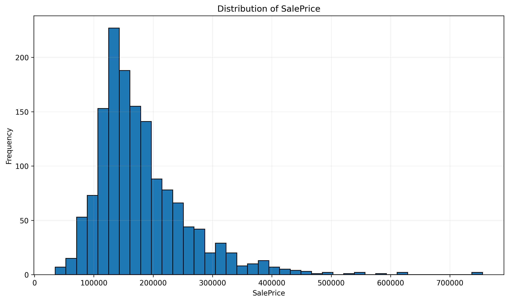

房价中位数：163000.0 ；房价众数： 140000；房价最小值：34900；房价最大值：755000

偏度 Skewness：1.8829；
峰度 Kurtosis：6.5363

图2：log_saleprice_distribution
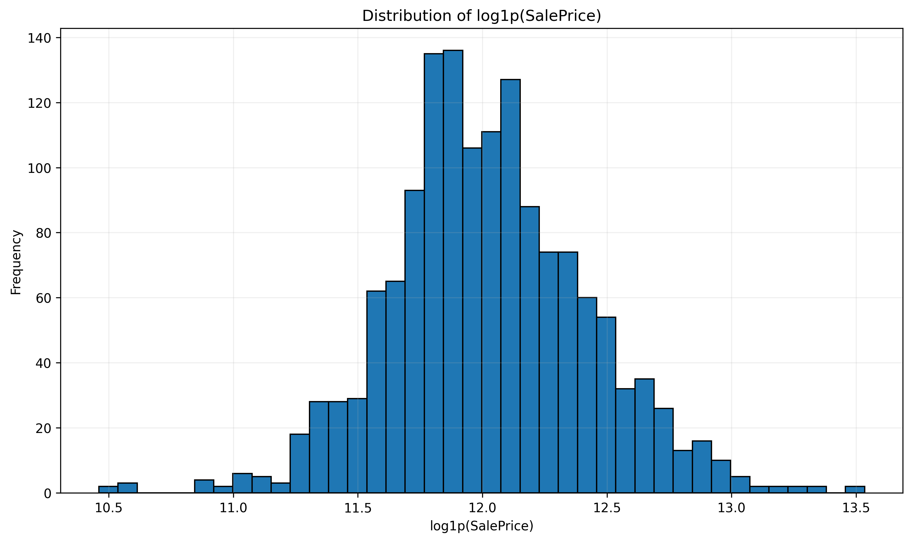

对数转换后的偏度： 0.1213；
对数转换后的峰度： 0.8095

## 03_missing_value_analysis.py（缺失值查看）
缺失值分析
图3：train_missing_rate
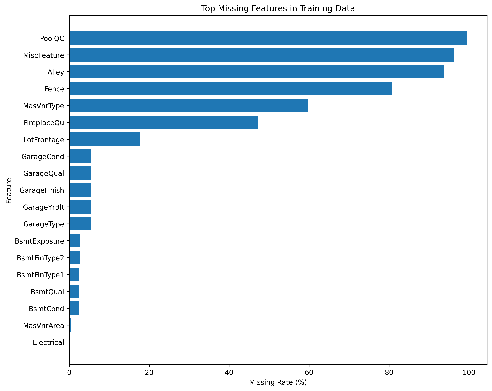

训练集缺失比例大于或等于50%的字段：
['PoolQC', 'MiscFeature', 'Alley', 'Fence', 'MasVnrType']

测试集缺失比例大于或等于50%的字段：
['PoolQC', 'MiscFeature', 'Alley', 'Fence', 'MasVnrType', 'FireplaceQu']

SalePrice缺失数量： 0；
SalePrice不存在缺失，可以正常用于模型训练。

如何处理这些缺失值呢？
先把这些缺失值分为三种情况：

1）缺失值表示没有该设施

| 字段 | 含义 | 空值通常表示 |
| :--- | :--- | :--- |
| `PoolQC` | 泳池质量 | 没有泳池 |
| `Alley` | 小巷入口类型 | 没有小巷入口 |
| `Fence` | 围栏质量 | 没有围栏 |
| `FireplaceQu` | 壁炉质量 | 没有壁炉 |
| `GarageType` | 车库类型 | 没有车库 |
| `BsmtQual` | 地下室质量 | 没有地下室 |
| `MiscFeature` | 其他设施 | 没有其他设施 |

2）缺失值表示这里填0

例如：车库 & 地下室

3）真正的数据缺失

LotFrontage（房屋临街长度）

## 04_missing_value_handling.py（缺失值处理）

处理前训练集缺失值总数： 7829；
处理前测试集缺失值总数： 7878

在process文件夹中，生成 test_clean 和 train_clean 两个文件，具体处理规则如下：

1. PoolQC、GarageType、BsmtQual 等类别字段的缺失值表示

   房屋不存在对应设施，因此填充为字符串 None。
2. GarageArea、TotalBsmtSF、MasVnrArea 等数值字段在对应

   设施不存在时填充为 0。
3. LotFrontage 使用同一 Neighborhood 社区中的中位数填充。
4. Electrical、MSZoning 等少量随机缺失的类别字段使用

   训练集众数填充。
5. 所有填补规则均从训练集计算，再应用于测试集，避免数据泄漏。

**注意：代码中填充中位数和众数时，只使用了训练集**

为什么这样做？测试集本来代表未知数据，避免数据泄露

## 05_numeric_feature_analysis（特征分析）

数值型字段数量（包括Id和SalePrice）： 38

真正用于分析的数值型特征数量： 36

#### 相关系数矩阵

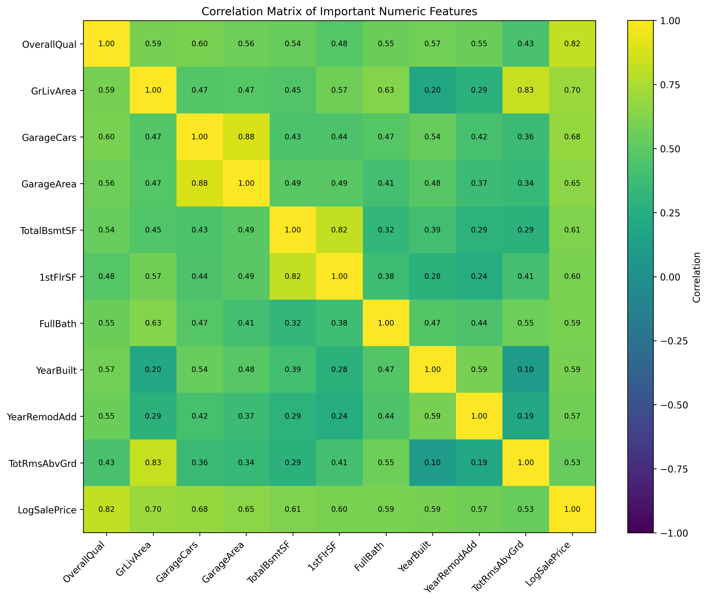

OverallQual 与房价的相关性最强，房屋整体质量等级越高， 房价总体越高。

部分特征之间存在较强相关性：
- GarageCars 与 GarageArea：0.88

- GrLivArea 与 TotRmsAbvGrd：0.83

- TotalBsmtSF 与 1stFlrSF：0.82

#### 前20个重要特征

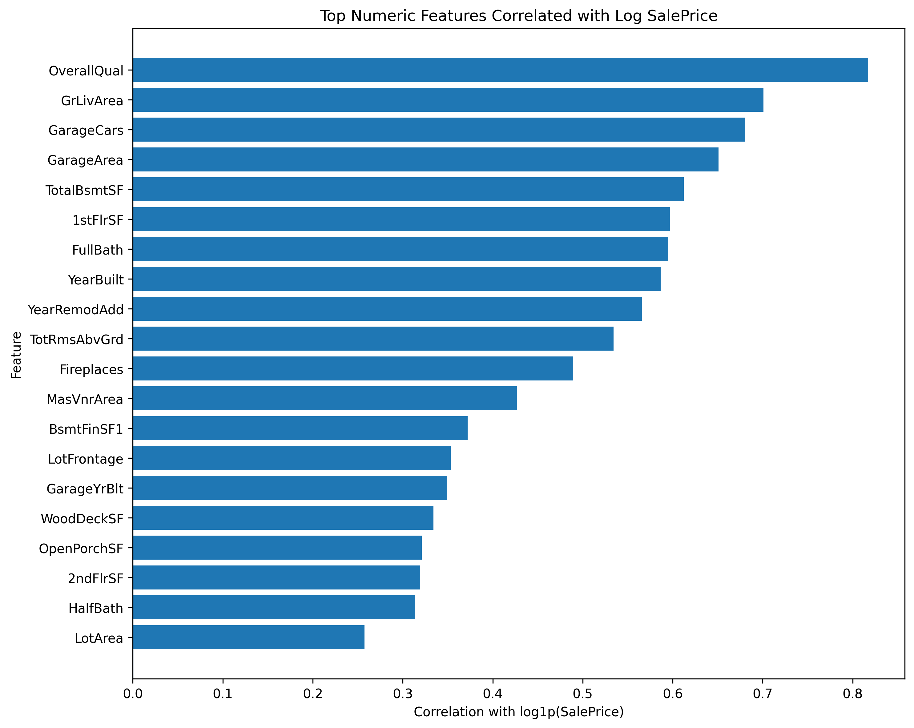

| 特征 | 相关系数 | 解释 |
| :--- | ---: | :--- |
| `OverallQual` | 0.82 | 房屋整体材料和装修质量 |
| `GrLivArea` | 0.70 | 地上居住面积 |
| `GarageCars` | 0.68 | 车库可容纳车辆数 |
| `GarageArea` | 0.65 | 车库面积 |
| `TotalBsmtSF` | 0.61 | 地下室总面积 |
| `1stFlrSF` | 0.60 | 一楼面积 |
| `FullBath` | 0.59 | 完整卫生间数量 |
| `YearBuilt` | 0.59 | 建造年份 |
| `YearRemodAdd` | 0.57 | 最近翻修年份 |
| `TotRmsAbvGrd` | 0.53 | 地上房间总数 |

#### 重要特征分析

##### 1）OverallQual_vs_log_saleprice（房屋整体材料和装修质量）

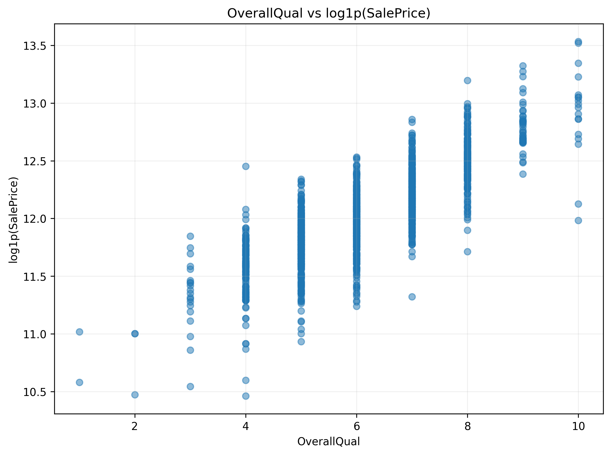

质量等级1—4：房价整体较低

质量等级5—7：样本最多，价格分布较广

质量等级8—10：房价整体明显提高

##### 2）GrLivArea_vs_log_saleprice（地上居住面积）

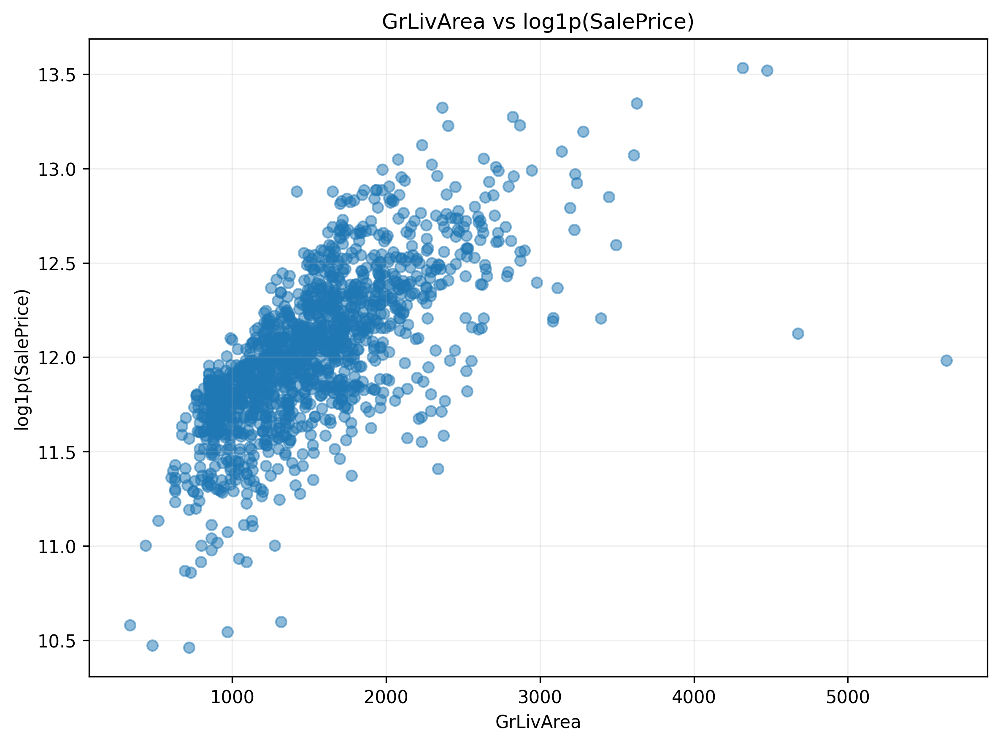

绝大多数点形成了明显的右上趋势（随着地上面积的增加，房价上升），但是最右侧有两个非常突出的样本（属于高杠杆异常点）

##### 3）GarageCars_vs_log_saleprice（车库可容纳车辆数）

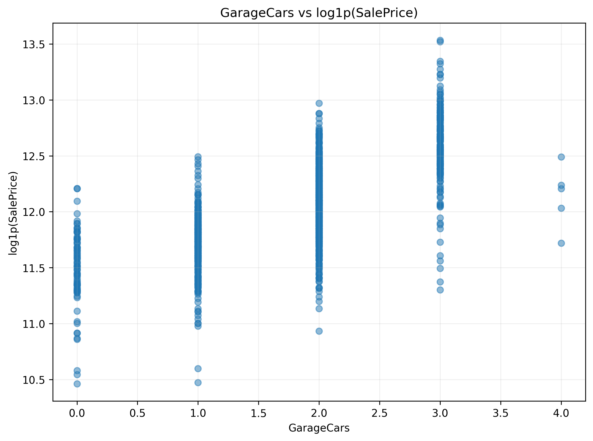

无车库 < 1车位 < 2车位 < 3车位

##### 4）GarageArea_vs_log_saleprice（车库面积）

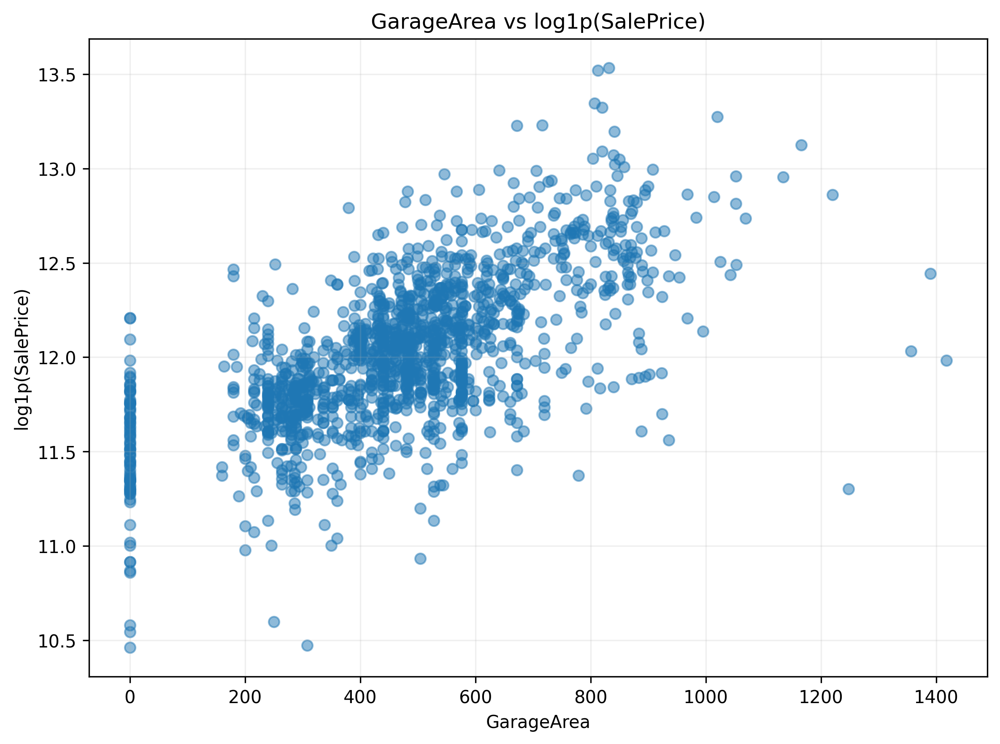

整体呈正相关关系，但离散程度比 GrLivArea 更大

##### 5）TotalBsmtSF_vs_log_saleprice（地下室总面积）

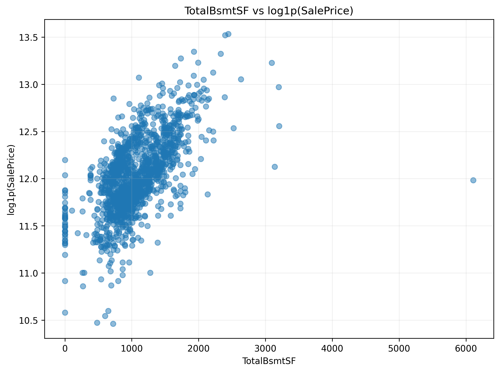

主体样本呈现正相关趋势，但存在极端案例（右侧的点），它很可能和 GrLivArea 图中最右侧的大面积低价样本是同一套房屋。也就是说，同一个异常交易会同时出现在多个面积变量的散点图中

##### 6）1stFlrSF_vs_log_saleprice（一楼面积）

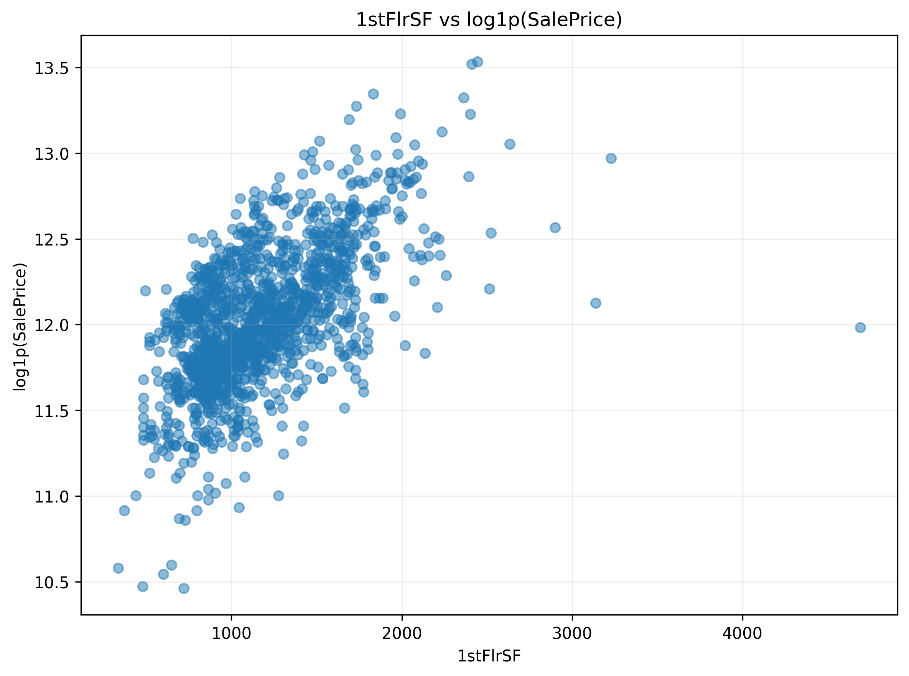

同样存在一个非常明显的最右侧低价点

因此，在这部分代码末尾，找出这些异常点，并存入：large_house_outlier_candidates.csv

## 06_outlier_analysis（异常值处理）

处理规则：
(train["GrLivArea"] > 4000) &
(train["SalePrice"] < 300000)

即：同时满足两个条件才删除： 地上居住面积超过 4000； 且售价低于 300000。

处理前：

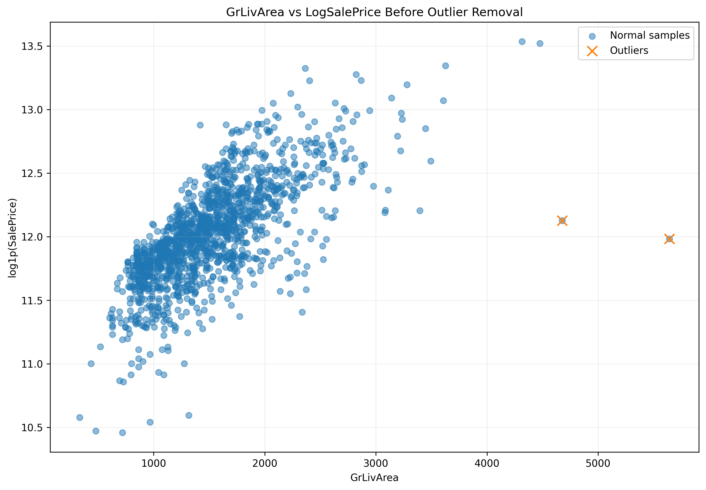

处理后：

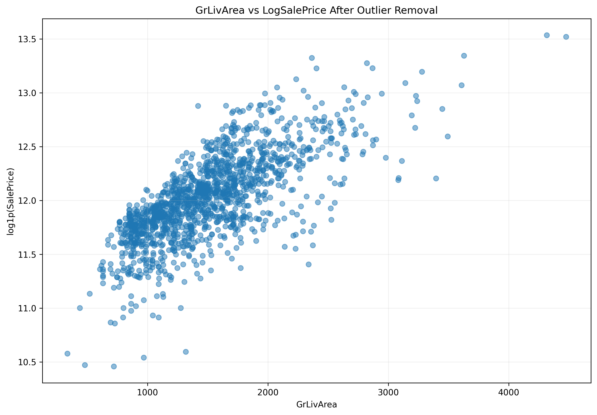

处理结果：

删除的样本数量： 2；
删除前训练集形状： (1460, 81)；
删除后训练集形状： (1458, 81)

## 07_categorical_feature_analysis.py（类别特征分析）

本阶段分析类别型特征与 log1p(SalePrice) 之间的关系。

由于类别变量不能直接使用普通 Pearson 相关系数，因此使用

**_Eta Squared_** 衡量不同类别对房价差异的解释程度。

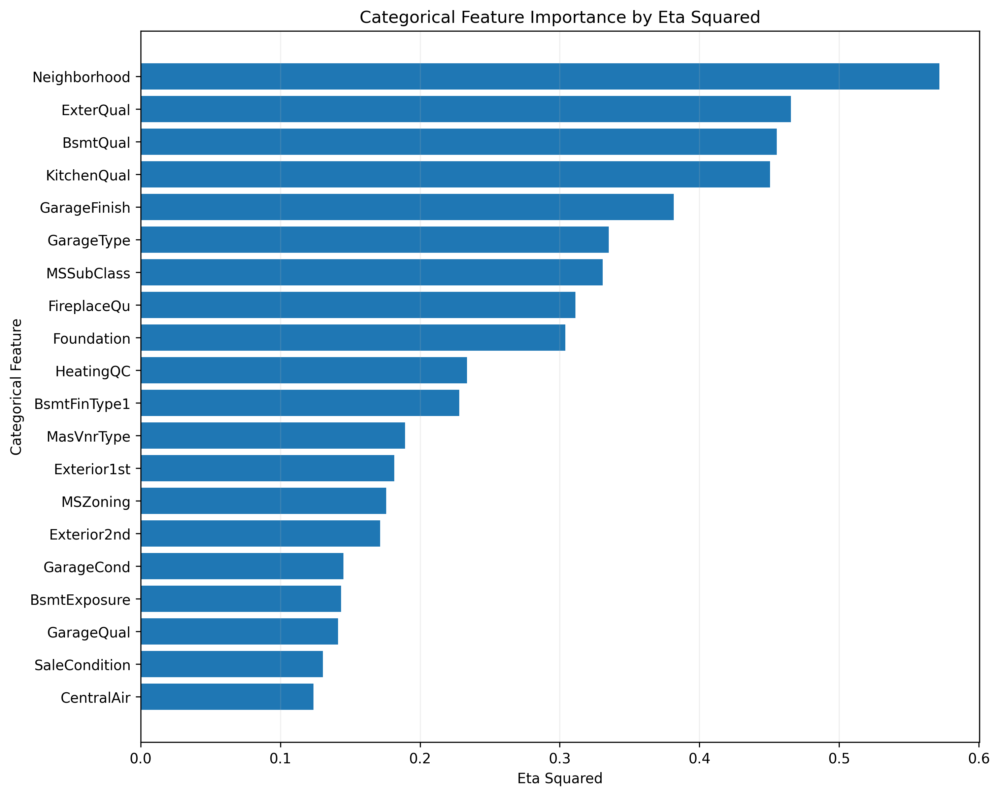

影响程度最高的前8个类别特征：

| 类型 | 代表字段 | 主要特点 |
| :--- | :--- | :--- |
| 有明确等级顺序 | `ExterQual`、`BsmtQual`、`KitchenQual`、`FireplaceQu`、`GarageFinish` | 等级越高，房价通常越高 |
| 无明确大小顺序 | `Neighborhood`、`GarageType`、`MSSubClass` | 不同类别房价不同，但不能直接比较编号大小 |
| 是否存在设施 | `NoFeature` 类别 | “没有设施”本身也是重要信息 |

##### 1）Neighborhood_category_boxplot：社区

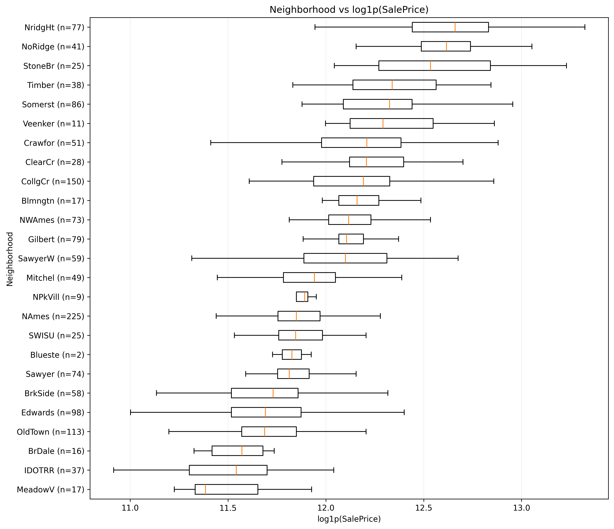

Neighborhood 应当作为模型中的核心类别特征，并采用独热编码

##### 2）ExterQual_category_boxplot：外部材料质量

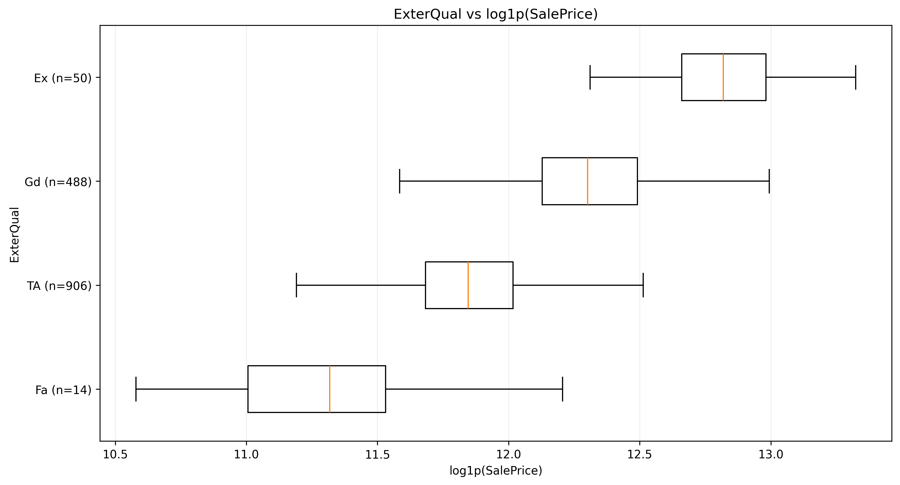

Ex：Excellent，优秀；
Gd：Good，良好；
TA：Typical/Average，一般；
Fa：Fair，较差

有明显等级关系：Ex > Gd > TA > Fa

##### 3）BsmtQual_category_boxplot：地下室质量

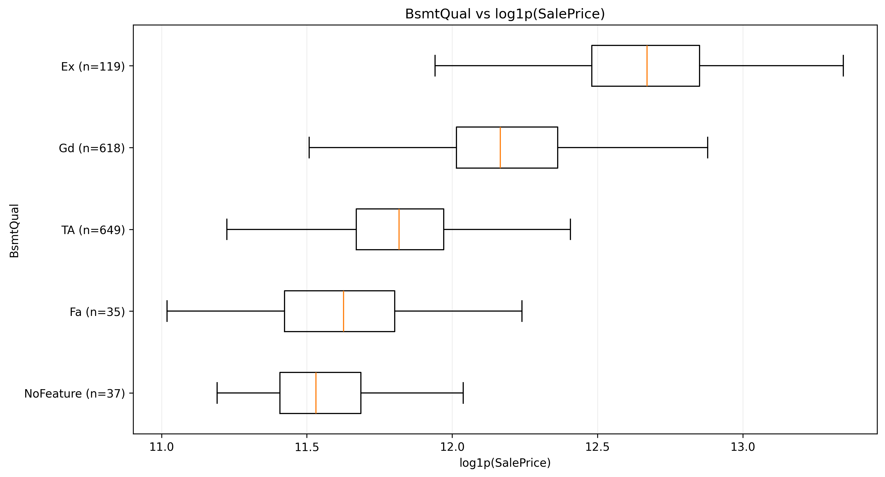

Ex > Gd > TA > Fa > NoFeature，
缺失值填为 NoFeature 是正确的，因为“没有地下室”本身具有预测价值，不能把它简单当作普通缺失值删除。

##### 4）KitchenQual_category_boxplot：厨房质量

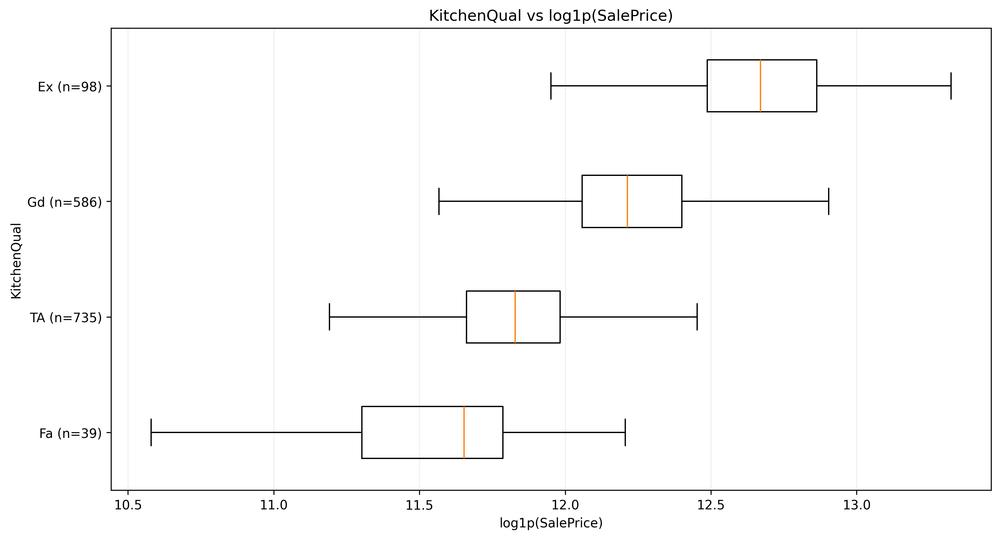

有明显等级关系：Ex > Gd > TA > Fa

##### 5）GarageFinish_category_boxplot：车库装修状态

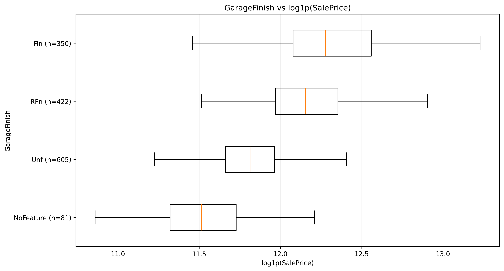

这是一个有顺序信息的特征

##### 6）GarageType_category_boxplot：车库类型

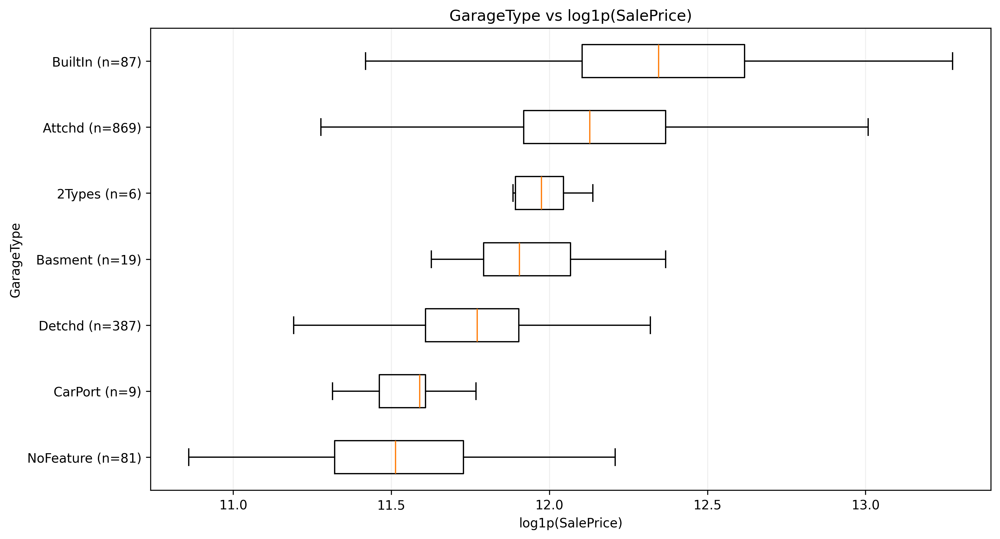

GarageType 没有严格的等级顺序，更适合使用独热编码，而不是映射成1、2、3、4

# 08_baseline_model（主代码-完整交叉验证）

全部流程：
读取原始数据
→ 删除训练集异常值
→ 拆分特征和目标
→ 五折交叉验证
→ 每一折内部清洗和编码
→ 训练 Dummy 与 Ridge
→ 比较 RMSE
→ 用全部训练数据重新训练
→ 预测测试集
→ 还原实际房价
→ 生成 submission.csv

#### 1）读取数据
代码读取的是：
data/raw/train.csv 和 data/raw/test.csv

而不是：
train_model.csv 和 test_clean.csv

原因：train_clean.csv 是使用整个训练集计算中位数、众数之后生成的，适合做数据分析，但在严格交叉验证中可能存在轻微的数据泄漏

将训练集拆分为80%的训练数据和20%的验证数据

#### 2）HousePriceCleaner

数据清洗器，功能如下：
- fit：从训练数据中学习规则
- transform：使用学到的规则处理数据

在 fit() 中，程序会从当前训练折学习

学什么？例如：数值型类别的中位数&众数，方便缺失值填充

而 transform() 会将 fit() 学到的规则应用到训练折、验证折或者测试集

如：将 MSSubClass 转换成类别（原来是数值，但每个数值代表一个类别）

如：将不存在的设施填为 NoFeature

如：房屋没有地下室则填0

#### 3）ColumnTransformer

数值型特征 和 类别型特征 分别用不同的方法处理

如何处理数值型特征 —— 数值缺失兜底填中位数 → 标准化（把不同量纲的特征转换到相近尺度）

标准化后，大多特征变为：均值约为0 , 标准差约为1

如何处理类别型特征 —— 类别缺失兜底填众数 → 独热编码

#### 4）Pipeline 连接

- HousePriceCleaner
业务含义上的缺失值处理
- ColumnTransformer
数值标准化 + 类别独热编码
- 回归模型
- 预测对数房价

#### 5）注意：只删除训练集的异常值

#### 6）注意：训练模型时删除ID列

#### 7）对 SalePrice 取 log1p (y = log(1+SalePrice))

#### 8）五折交叉验证
什么叫五折交叉验证？
- 把1458个样本划分成5份

大致流程：

第1折：
第1份验证，其余4份训练

第2折：
第2份验证，其余4份训练

第3折：
第3份验证，其余4份训练

第4折：
第4份验证，其余4份训练

第5折：
第5份验证，其余4份训练

每个样本被用于验证1次 ，被用于训练4次

且每一折都会进行：清洗器fit ；预处理器fit ；模型fit

例如：第1折训练部分 → 学习中位数、众数、独热编码类别 → 训练岭回归 → 预测第1折验证部分 → 计算RMSE

#### 9）Dummy 模型的作用

它不会真正学习房屋特征，只会预测：训练折目标值的平均数

假设训练折平均对数房价是：12.02；那么它会对所有验证样本都预测：12.02

所以它只是一个参考标准

Dummy 模型代表一个最低参照标准。

如果正式模型连 Dummy 都无法超过，说明：

特征处理可能有问题；
模型设置可能有问题；
当前模型没有真正学到规律。

正常情况下，Ridge 应该明显优于 Dummy

#### 10）Ridge 岭回归

岭回归就是在普通线性回归的基础上，增加一条规定：模型不仅要预测准确，系数也不能过度膨胀。

alpha的作用

alpha越接近0，表示岭回归越接近普通的线性回归；而alpha越大，表示它对系数的限制性更强

注意：岭回归前必须先标准化

岭回归能解决的问题：
- 特征很多；
- 特征之间高度相关；
- 独热编码产生大量字段；
- 普通线性回归系数不稳定；
- 模型存在一定过拟合；

#### 11）RMSE（Root Mean Squared Error 均方根误差）

运行五折交叉验证后，得到平均RMSE（这代表模型在五份未知验证数据上的总体误差水平）

再看标准差

当【平均值低、标准差也低】，则可判断：模型准确，而且不同数据划分下都比较稳定

#### 12）在每一折交叉验证中主要流程

1. 岭回归使用训练折学习所有特征的系数
2. 岭回归对验证折预测log1p(SalePrice)
3. 用真实对数房价减去预测对数房价
4. 计算每个样本的平方误差
5. 求平均得到MSE
6. 开平方得到这一折RMSE
7. 五折结束后计算平均RMSE和标准差
